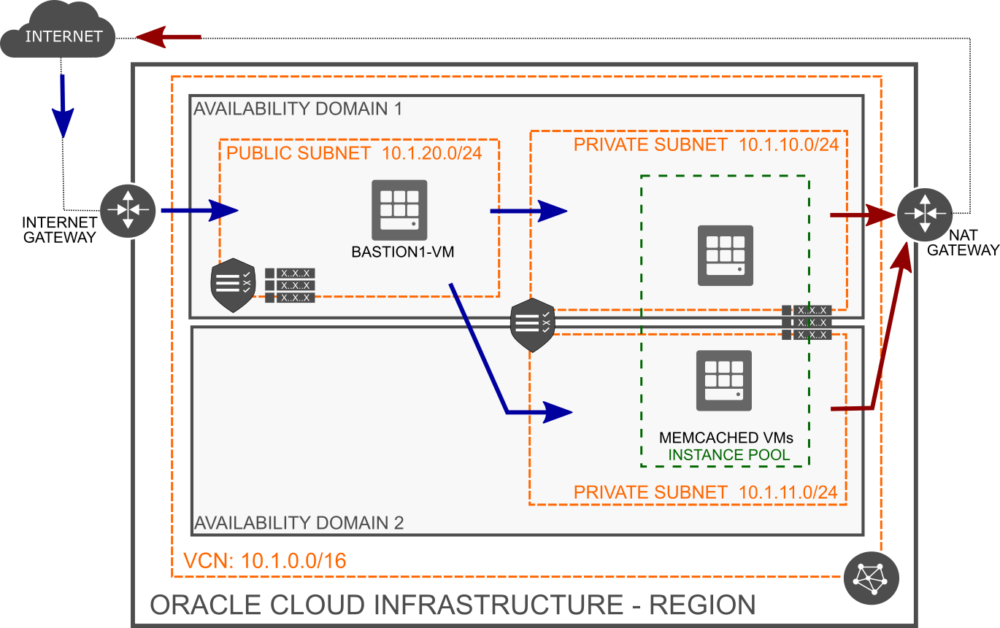

# oci-memcached
Terraform module to deploy Memcached on Oracle Cloud Infrastructure (OCI)
# Memcached
Memcached is a simple in-memory key-value store for small data chunks. It can be used as an LRU-based cache for pre-serialized data. The responsibility is split between client and server. Server can store and fetch data. You can add more servers to increase the total memory, however, there is neither replication nor synchronizations between servers. Clients have to use a key-based hashing algorithm of their choice to know on which server the particular data are.

You can find more info here: https://memcached.org/

# Oracle Cloud Infrastructure Resources
This repository contains three sets of Terraform artifacts:

* `infrastructure/*.tf`

   This is a sample root-level project that shows how to use bastion- and memcached- modules. You can use it to quickly provision the entire, working setup to test the infrastructure. In most cases, however, you will just copy the required `module` section from the `infrastructure/modules.tf` file and set the module input variables using your project values.

   The files in this folder will provision a **VCN** and an **Internet Gateway** cloud resources. Furthermore, they will provision all resources included in **bastion-host module** and **memcached module** as described below.

* `infrastructure/bastion/*.tf`

  This is a bastion-host module that runs a single instance in a public subnet. The Compute instance can be used as a bastion host to allow ingress traffic to private subnets of the same VCN.

  The files in this folder will provision a **Route Table**, a **Security List**, one **Subnet** and a **Compute instance**, all dedicated to Bastion Host.

  You can use this module in your project. Apart from the module folder, copy the required `module "bastion"` section from the `infrastructure/modules.tf` file and set the module input variables (VCN OCID, Internet Gateway OCID, Subnet CIDR and Compute Image OCID) using your project values.

* `infrastructure/cache/*.tf`

  This is memcached module that runs an instance pool of Memcached Compute instances in two, newly created private subnets spread across two availability domains. The instances will use newly provisioned NAT Gateway to be able to download and install memcached software.

  The files in this folder will provision a **NAT Gateway**, a **Route Table**, a **Security List**, two **Subnet**, an **Instance Configuration** and an **Instance Pool** cloud resources, all dedicated to Memcached Instance Pool.

  You can use this module in your project. Apart from the module folder, copy the required `module "cache"` section from the `infrastructure/modules.tf` file and set the module input variables (VCN OCID, Subnet CIDRs, Compute Image OCID and expected number of instances in the pool) using your project values.

