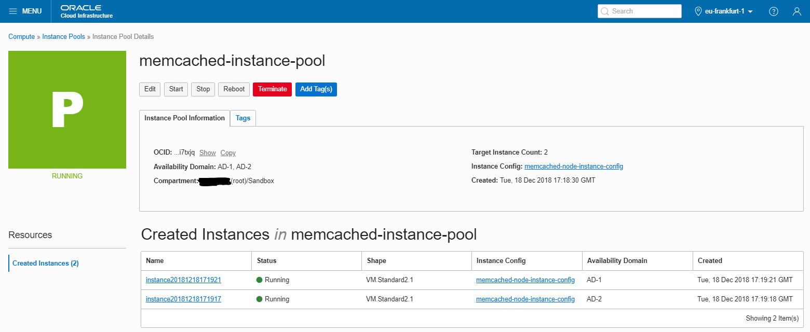

# oci-memcached
Terraform module to deploy Memcached on Oracle Cloud Infrastructure (OCI)

## Memcached
Memcached is a simple in-memory key-value store for small data chunks. It can be used as an LRU-based cache for pre-serialized data. The responsibility is split between client and server. Server can store and fetch data. You can add more servers to increase the total memory, however, there is neither replication nor synchronizations between servers. Clients have to use a key-based hashing algorithm of their choice to know on which server the particular data are.

You can find more info here: https://memcached.org/

## Oracle Cloud Infrastructure Resources
This repository contains three sets of Terraform artifacts:

* `infrastructure/*.tf` - This is a <span style="color:brown">sample root-level project</span> that shows how to use bastion- and memcached- modules. You can use it to quickly provision the entire, working setup to test the infrastructure. In most cases, however, you will just copy the required `module` section from the `infrastructure/modules.tf` file and set the module input variables using your project values.  The files in this folder will provision a **VCN** and an **Internet Gateway** cloud resources. Furthermore, they will provision all resources included in **bastion-host module** and **memcached module** as described below.
* `infrastructure/bastion/*.tf` - This is a <span style="color:brown">bastion-host module</span> that runs a single instance in a public subnet. The Compute instance can be used as a bastion host to allow ingress traffic to private subnets of the same VCN.  The files in this folder will provision a **Route Table**, a **Security List**, one **Subnet** and a **Compute instance**, all dedicated to Bastion Host.  You can use this module in your project. Apart from the module folder, copy the required `module "bastion"` section from the `infrastructure/modules.tf` file and set the module input variables (VCN OCID, Internet Gateway OCID, Subnet CIDR and Compute Image OCID) using your project values.
* `infrastructure/cache/*.tf` - This is <span style="color:brown">memcached module</span> that runs an instance pool of Memcached Compute instances in two, newly created private subnets spread across two availability domains. The instances will use newly provisioned NAT Gateway to be able to download and install memcached software.  The files in this folder will provision a **NAT Gateway**, a **Route Table**, a **Security List**, two **Subnet**, an **Instance Configuration** and an **Instance Pool** cloud resources, all dedicated to Memcached Instance Pool.  You can use this module in your project. Apart from the module folder, copy the required `module "cache"` section from the `infrastructure/modules.tf` file and set the module input variables (VCN OCID, Subnet CIDRs, Compute Image OCID and expected number of instances in the pool) using your project values.


## Prerequisites
Make sure you've completed the actions listed below:
1. Own an **Oracle Cloud account**. You can use a new trial account (see [here](https://cloudcomputingrecipes.com/2018/10/08/oci-1-cloud-account/) for more details)
2. Install and configure **Terraform** (see [here](https://cloudcomputingrecipes.com/2018/10/30/oci-7-terraform-setup/) for more details)
3. Generate a new **SSH Keypair** (private key `oci_id_rsa` and public key `oci_id_rsa.pub`) in `~/.ssh` folder (see [here](https://cloudcomputingrecipes.com/2018/10/21/ssh-keypair/) for more details)
4. Know how to access **Oracle Cloud Infrastructure Console** (see [here](https://cloudcomputingrecipes.com/2018/10/09/oci-2-access-oci-console/) for more details)

## Option 1: Use Memcached module as a part of sample, testable project
This repository contains a <span style="color:brown">sample root-level project</span> that combines two modules: <span style="color:brown">bastion-host</span> and <span style="color:brown">memcached</span>. You can deploy the entire setup, smoke test memcached like described below and incrementally add new resources to build your target infrastructure.

Make sure these environment variables are set:
```shell
# Tenancy
export TF_VAR_tenancy_ocid={put-here-the-tenancy-ocid}
export TF_VAR_region={put-here-the-region} # for example: eu-frankfurt-1
# User
export TF_VAR_user_ocid={put-here-the-user-ocid}
# API Key
export TF_VAR_private_key_path={put-here-the-path-to-the-private-key}
export TF_VAR_private_key_password={put-here-the-private-key-password}
export TF_VAR_fingerprint={put-here-the-public-key-fingerprint}
```
Execute the provisioning script:
```shell
 git clone https://github.com/cloud-partners/oci-memcached.git
 cd infrastructure
 terraform init
 terraform apply --auto-approve
 # terraform destroy # Uncomment and execute later to terminate the resources
```
It will take a few minutes to boot and initialize your compute instances. At the end you should see the public IP of your bastion host. For example:
```shell
Apply complete! Resources: 13 added, 0 changed, 0 destroyed.
Outputs:
Bastion public IP = 130.61.122.2
Memcached private IPs = [
    10.1.10.2,
    10.1.11.2
]
```
Connect your bastion host and smoke test both memcached servers:
```shell
ssh opc@130.61.122.2 # Use "ubuntu" instead of "opc" if you've used Ubuntu-based image'
```
```
[opc@bastion-1-vm ~]$ sudo yum install telnet
[opc@bastion-1-vm ~]$ telnet 10.1.10.2 11211
Trying 10.1.10.2...
Connected to 10.1.10.2.
Escape character is '^]'.
get data.books.code.1255
END
set data.books.code.1255 1 0 5
Iliad
STORED
get data.books.code.1255
VALUE data.books.code.1255 1 5
Iliad
END
```

## Option 2: Use Memcached module as a part of your infrastructure
This repository contains a standalone <span style="color:brown">memcached module</span> you can incorporate into your existing Terraform-based infrastructure in Oracle Cloud.

Just copy the entire folder `infrastructure/cache/` and include a module reference in your existing infrastructure. You will need to adjust the values, of course.
```
module "cache" {
  source = "cache"
  compartment_ocid = "${var.compartment_ocid}"
  vcn_ocid = "${oci_core_virtual_network.solution_vcn.id}"
  vcn_subnet_cidrs = [ "10.1.10.0/24", "10.1.11.0/24" ]
  ads = [ "${local.ad1}", "${local.ad2}" ]
  compute_image_ocid = "${local.oracle_linux_image_ocid}"
  instance_pool_size = 2
}
```
You can reuse the existing module output:
```
output "Memcached private IPs" { value = "${module.cache.memcached_ips}" }
```
## Known Issues
Because of Terraform 0.11.x missing functionality (no proper null check possible for data source in interpolation) you need to remove Memcached private IPs output form the script, <span style="color:red">if you want to scale up or scale down the size of an existing pool using this module</span>. The ultimate code fix will be provided as soon as Terraform 0.12 is GA.

This concludes the README. Enjoy your setup:


